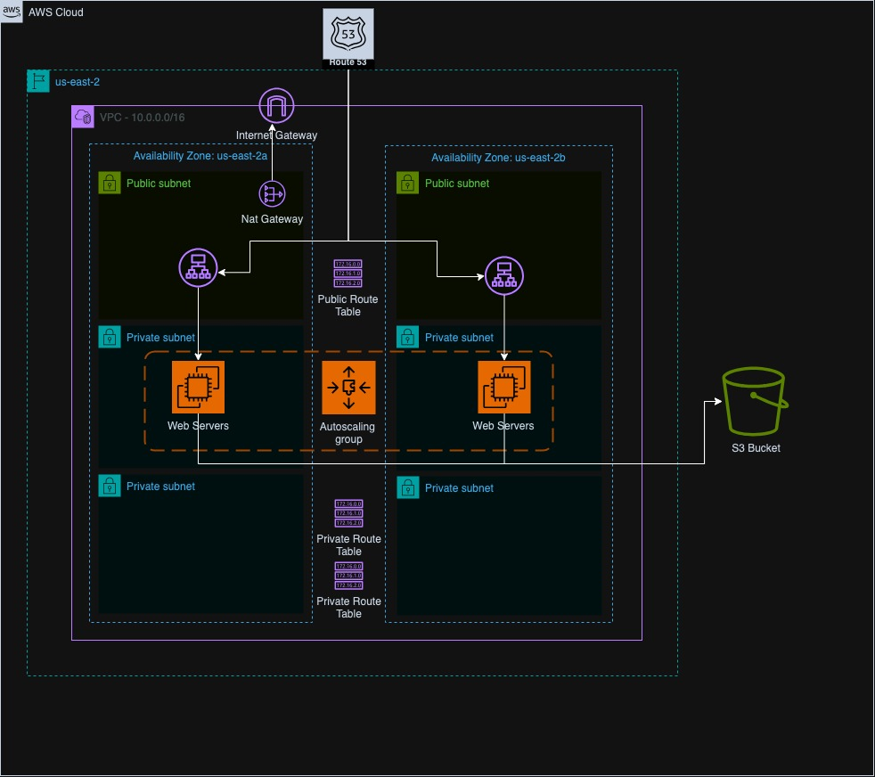

# Architecture design 

The application is based on a three tier architecture, in the image above, the hight level overview has been described with the core resources used for this demo

## Network layer
It's build with the classic components for an AWS app, starting with a VPC as the main container, 2 public subnets to host the presentation layer, 4 private subnets to host busines and data layers, an internet gateway as well as an Nat Gateway.
